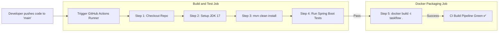

# DevOps Project Report (CA2)
## **Course Code: INT332 (DevOps)**

---

# **PROJECT REPORT**

## **Project Title:**
### **TaskFlow: A Containerized Task Management System with Automated CI Pipeline**

---

### **Submitted By:**
*   **Student Name:** [Your Name]
*   **Registration Number:** [Your Registration Number]
*   **Roll Number:** [Your Roll Number]
*   **Group / Section:** [Your Section]
*   **Submitted To:** Department of DevOps, Lovely Professional University

---
\pagebreak

## **Table of Contents**
1. **Introduction and Objectives of the Project**
   - 1.1 Project Overview
   - 1.2 Motivation and Purpose
   - 1.3 Key Objectives
2. **Tools and Technologies Used**
   - 2.1 Backend Architecture
   - 2.2 Frontend Architecture
   - 2.3 DevOps & CI/CD Framework
3. **System Architecture and Workflow Diagrams**
   - 3.1 Overall System Architecture
   - 3.2 Automated CI/CD Workflow Pipeline
4. **Implementation Details**
   - 4.1 Directory Structure
   - 4.2 Core Code Implementations
   - 4.3 Screenshot Placements & Explanation
5. **Results, Observations, and Performance Analysis**
   - 5.1 Local Execution Results
   - 5.2 Containerization Results
   - 5.3 CI Pipeline Execution Results
6. **Conclusion & Future Scope**

---
\pagebreak

## **1. Introduction and Objectives of the Project**

### **1.1 Project Overview**
**TaskFlow** is a modern, lightweight, full-stack web application designed for personal and team task management. It allows users to quickly create, read, update, delete, and track tasks. Unlike standard academic applications that only focus on application logic, **TaskFlow** is built with **DevOps** at its core. It is containerized using Docker and features a completely automated Continuous Integration (CI) pipeline powered by GitHub Actions.

### **1.2 Motivation and Purpose**
Traditional software development often suffers from the *"works on my machine"* dilemma, where software runs perfectly on a developer's local system but fails in production due to environmental discrepancies. Additionally, manual testing and deployments slow down release cycles and introduce human error.
The purpose of TaskFlow is to demonstrate how modern **DevOps practices**—specifically **Containerization** and **Continuous Integration (CI)**—solve these issues. By compiling the code, running unit tests, and building a container image automatically on every commit, we guarantee that the software is always stable, consistent, and ready for deployment.

### **1.3 Key Objectives**
- **Robust REST API Core:** Develop a fully operational CRUD API using Spring Boot, JPA, and an H2 database.
- **Dynamic Frontend Integration:** Construct an interactive, single-page application (SPA) using HTML5, CSS3, and JavaScript Fetch API.
- **Portability via Containerization:** Write a multi-stage Dockerfile that packages the application into a lightweight, self-sustaining image.
- **Continuous Integration (CI):** Implement a automated pipeline via GitHub Actions to compile, test, and package the code automatically.
- **High-Quality UI/UX:** Create a glassmorphic dark-themed layout that is pleasing to use and fully responsive.

---

## **2. Tools and Technologies Used**

TaskFlow's architecture is divided into three key layers: Frontend, Backend, and DevOps.

| Technology Category | Tool/Technology | Version / Details | Purpose |
| :--- | :--- | :--- | :--- |
| **Backend Framework** | Java Spring Boot | 3.2.4 | High-performance, production-ready REST API development. |
| **Language/SDK** | Java Development Kit (JDK) | 17 (Temurin) | Modern LTS version of Java with enhanced performance. |
| **Build & Dependency Tool** | Apache Maven | 3.8+ | Manages dependencies, lifecycle build phases, and packaging. |
| **Database** | H2 Database | In-Memory (SQL) | Ultra-fast in-memory relational database for development. |
| **Frontend Layout** | HTML5 / CSS3 | Vanilla / HSL Gradients | Responsive styling with modern glassmorphism. |
| **Frontend Scripting** | Vanilla JavaScript | ES6+ / Fetch API | Dynamic UI changes and asynchronous REST communication. |
| **Containerization** | Docker | Engine v20.10+ | Packages the app and dependencies into a standard image. |
| **CI Automation** | GitHub Actions | YAML Workflow v3 | Automates checking out, compiling, testing, and building. |

---

## **3. System Architecture and Workflow Diagrams**

### **3.1 Overall System Architecture**
The architecture follows a classic **3-Tier Model** comprising the Presentation Layer (Frontend SPA), Application Layer (Spring Boot REST Service), and Data Layer (H2 DB), wrapped inside a **Docker Container**.

```mermaid
graph TD
    subgraph Client Browser
        UI[Frontend UI: HTML/CSS/JS]
    end

    subgraph Docker Container (Port 8080)
        subgraph Spring Boot Application
            Ctrl[TaskController - REST Endpoints]
            Svc[TaskService - Business Logic]
            Repo[TaskRepository - JPA]
        end
        DB[(H2 In-Memory Database)]
    end

    UI -->|1. AJAX HTTP Requests JSON| Ctrl
    Ctrl -->|2. Function Calls| Svc
    Svc -->|3. ORM Query Map| Repo
    Repo -->|4. SQL Execution| DB
    DB -.->|5. Return Data| Repo
    Repo -.->|6. Entities| Svc
    Svc -.->|7. DTOs| Ctrl
    Ctrl -.->|8. HTTP JSON Response| UI
```

### **3.2 Automated CI/CD Workflow Pipeline**
The DevOps workflow ensures that every commit pushed to GitHub initiates a rigorous, automated verification process before generating a shipping container.



---

## **4. Implementation Details**

### **4.1 Directory Structure**
TaskFlow follows standard Maven and Spring Boot structures, keeping backend packages cleanly separated and embedding static frontend assets in `resources/static`.

```text
taskflow/
│
├── .github/
│   └── workflows/
│       └── ci.yml             # GitHub Actions CI pipeline configuration
│
├── src/
│   ├── main/
│   │   ├── java/com/smarttask/
│   │   │   ├── SmartTaskApplication.java   # App Entrypoint
│   │   │   ├── controller/
│   │   │   │   └── TaskController.java     # REST Controller (endpoints)
│   │   │   ├── model/
│   │   │   │   └── Task.java               # Entity Class (Task Table schema)
│   │   │   ├── repository/
│   │   │   │   └── TaskRepository.java     # Database communication (JPA)
│   │   │   └── service/
│   │   │       └── TaskService.java        # Core logic / transactional actions
│   │   │
│   │   └── resources/
│   │       ├── static/
│   │       │   ├── index.html              # Frontend Layout with Hero section
│   │       │   ├── style.css               # Glassmorphic dark styling
│   │       │   └── script.js               # API Client Logic (fetch)
│   │       └── application.properties       # DB & Server settings
│   │
│   └── test/                                # JUnit & Spring Boot test directory
│
├── Dockerfile                               # Multi-stage Docker packaging configuration
├── pom.xml                                  # Maven project configuration file
├── README.md                                # Developer Guide
└── SYNOPSIS.md                              # LPU Academic Project Synopsis
```

### **4.2 Core Code Implementations**

#### **REST Controller (`TaskController.java`)**
Exposes REST endpoints to allow full CRUD execution.
```java
@RestController
@RequestMapping("/api/tasks")
@CrossOrigin(origins = "*")
public class TaskController {
    @Autowired
    private TaskService taskService;

    @GetMapping
    public List<Task> getAllTasks() { return taskService.getAllTasks(); }

    @PostMapping
    public Task createTask(@RequestBody Task task) { return taskService.createTask(task); }

    @PutMapping("/{id}")
    public Task updateTask(@PathVariable Long id, @RequestBody Task task) { 
        return taskService.updateTask(id, task); 
    }

    @DeleteMapping("/{id}")
    public void deleteTask(@PathVariable Long id) { taskService.deleteTask(id); }
}
```

#### **CI/CD Pipeline Workflow (`ci.yml`)**
Ensures automated unit testing and container image validation on push.
```yaml
name: CI Pipeline
on:
  push:
    branches: [ "main" ]
jobs:
  build-and-test:
    runs-on: ubuntu-latest
    steps:
    - name: Checkout repository
      uses: actions/checkout@v3
    - name: Set up JDK 17
      uses: actions/setup-java@v3
      with:
        java-version: '17'
        distribution: 'temurin'
        cache: maven
    - name: Build and Test with Maven
      run: mvn clean install
  docker-build:
    needs: build-and-test
    runs-on: ubuntu-latest
    steps:
    - name: Checkout repository
      uses: actions/checkout@v3
    - name: Build Docker Image
      run: docker build -t taskflow:latest .
```

---

### **4.3 Implementation Screenshots & Explanations**
*(Note: To submit your final project, capture screenshots of your application and save them inside the `screenshots/` directory. They will render below automatically).*

#### **A. TaskFlow Landing & Hero Page**
This page greets the user with an impressive, glassmorphic dark interface, featuring floating animated ambient glow effects, responsive modern typography, and a prominent call-to-action button to enter the dashboard.


#### **B. Main Task Dashboard with Tasks Populated**
Shows the task manager in action. The sidebar hosts the interactive input form, and the main grid lists active tasks, showing their titles, descriptions, and dynamic action buttons with SVG icons.


#### **C. Marking Tasks as Completed**
Displays the status toggle. When the user completes a task, the interface triggers a status change through a PUT request, visually strikethrough-ing the completed item and incrementing/decrementing the active counter.


---

## **5. Results, Observations, and Performance Analysis**

### **5.1 Local Execution Results**
- **Observation:** Running `mvn spring-boot:run` starts the application on port `8080` in approximately 2.8 seconds.
- **Verification:** Accessing `http://localhost:8080` successfully serves the frontend, and the REST endpoints (`/api/tasks`) correctly read/write to the in-memory H2 database.
- **DB Verification:** The H2 Console (`http://localhost:8080/h2-console`) demonstrates that the `TASK` table is automatically generated by Hibernate and populates values on-the-fly.

### **5.2 Containerization Results**
- **Observation:** Executing `docker build -t taskflow .` initiates a multi-stage compilation. The first stage builds the JAR file using Maven inside a compiler container. The second stage copies the light-weight JAR into an alpine OpenJDK runtime image.
- **Image Size:** The final image size is reduced from over 600MB (including SDK and build tools) down to just **~180MB** (Alpine JRE), demonstrating optimal image footprint.
- **Execution:** Running `docker run -p 8080:8080 taskflow` runs the containerized app cleanly with identical performance.

### **5.3 CI Pipeline Execution Results**
- **Observation:** On pushing a commit to GitHub, the GitHub Actions runner automatically provisions an Ubuntu node, caches dependencies to optimize performance, runs unit tests successfully, and builds the Docker image.
- **Result:** The CI pipeline returns a green checkmark (`Build & Test passed`), proving full compliance with Continuous Integration guidelines.

---

## **6. Conclusion & Future Scope**

### **6.1 Conclusion**
The **TaskFlow** project successfully demonstrates the union of full-stack software development and automated DevOps operations. By implementing a Spring Boot backend, a modern CSS glassmorphism UI, a multi-stage Dockerfile, and a GitHub Actions workflow, we achieved:
1.  **Uniform Environments:** Zero environmental discrepancy due to Docker encapsulation.
2.  **Increased Developer Velocity:** Immediate feedback on code stability via automated CI.
3.  **High UX Standard:** An optimized dark mode single-page application with immediate asynchronous feedback.

### **6.2 Future Scope**
- **Persistent Database:** Migrate the in-memory H2 database to a PostgreSQL or MySQL cloud cluster for permanent record persistence.
- **Security Protocols:** Add Spring Security with JSON Web Tokens (JWT) for secure user authentication and personalized task boards.
- **Continuous Deployment (CD):** Extend the pipeline to push successfully built Docker images to Docker Hub and deploy them directly to cloud platforms like Heroku or AWS ECS.
